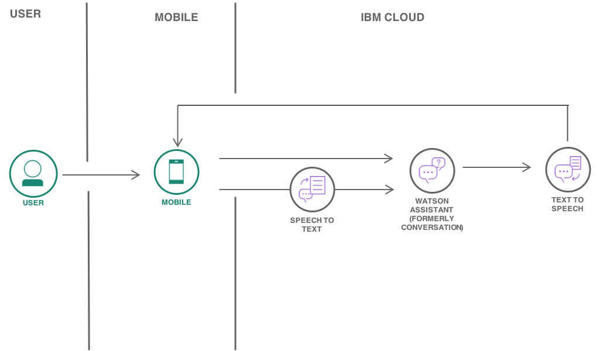
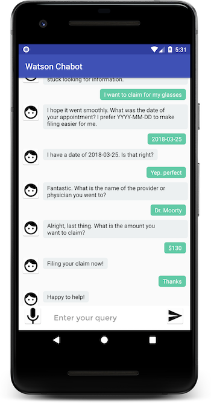

# A voice-enabled Android ChatBot powered by IBM Watson

Learn how easy it is to build an IBM Watson powered ChatBot running on Android and using Watson Assistant (formerly Conversation),Text-to-Speech, Speech-to-Text Services on IBM Cloud (an open standards, cloud platform for building, running, and managing apps and services).

For **step-by-step instructions**, refer this tutorial - [Build a voice-enabled Android chatbot](https://cloud.ibm.com/docs/tutorials?topic=solution-tutorials-android-watson-chatbot)

The tutorial walks you through the process of defining intents and entities and building a dialog flow for your chatbot to respond to customer queries. You will learn how to enable Speech to Text and Text to Speech services for easy interaction with the Android app.

## Install Andriod Studio
Install Andriod Studio 3.5.1

Android Studio 3.5.1
Build #AI-191.8026.42.35.5900203, built on September 25, 2019
JRE: 1.8.0_202-release-1483-b49-5587405 x86_64
JVM: OpenJDK 64-Bit Server VM by JetBrains s.r.o
macOS 10.15

### Enable Gradle Build
You may see an error when running the program for the first time <insert the error and how to fix it>
  
### Error no NDK
download from the link
  
### Enable Microphone
When running the emulator the host microphone (the mic on your laptop) must be enabled from inside the emulator.  To do this follow these steps:

1. start the emulator of choice
2. press ctrl+shift+r (note on mac this is cmd+shift+r), the `Extended Controls` window will open outside of the emulator.
3. In the `Extended Controls` window left menu bar select `Microphone`, this opens options for the microphone.
4. toggle `Virtual host uses host audio input` to on, this will turn the togggle switch from grey to green.
5. you can close the `Extended Controls` window and proceed with use of the microphone.

**IMPORTANT** It appears the change does not persist between shutdown of the emulator.  If the microphone is not working, check this option is turned on.

## Solution Tutorials 
For other solution tutorials, [click here](http://ibm.biz/solution-tutorials)
## License

See [License.txt](https://github.com/IBM-Cloud/chatbot-watson-android/blob/master/License.txt) for license information.
